# 💫 About Me:
👋 Hey there! I'm Satwik Naik, a passionate Cloud Technology and Full-Stack Technology enthusiast, currently pursuing B.Tech in Computer Science at PES University, Bangalore.

🔹 I specialize in Cloud Computing, Full-Stack Development, and Distributed Systems.
🔹 Enthusiastic about Spring Boot, Big Data Technologies, and Cloud Infrastructure.
🔹 Constantly exploring AWS, DevOps, and Microservices while contributing to open-source projects.

## 🌐 Socials:
 

# 💻 Tech Stack:
                          
# 📊 GitHub Stats:

---

<!-- Proudly created with GPRM ( https://gprm.itsvg.in ) -->
 

